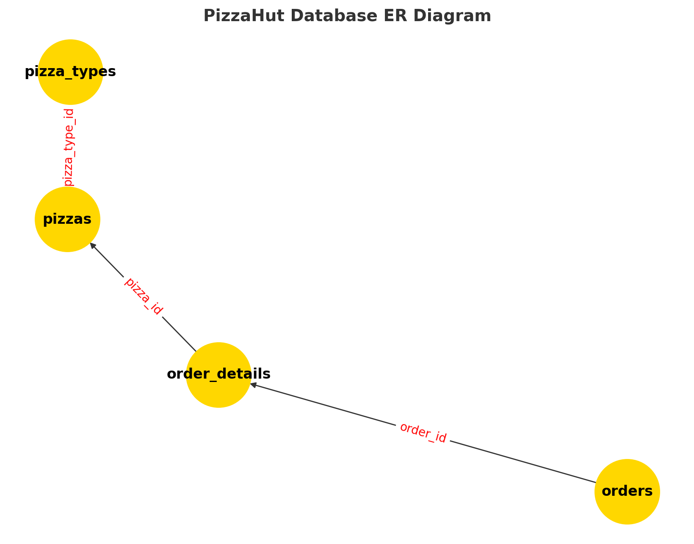

# 🍕 Pizza Sales Analysis (SQL)

## 📌 Overview
This project analyzes pizza sales data using SQL to uncover business insights such as:
- Which pizzas generate the highest revenue?
- What is the most popular pizza size?
- How do orders vary by time of day?
- Which pizza categories sell the most?

It’s designed as a **portfolio project** to showcase SQL skills, data analysis, and business intelligence thinking.

---

## 📂 Project Structure
pizza-sales-sql-project/
│
├── data/ # Raw dataset (CSV)
│ ├── order_details.csv
│ ├── orders.csv
│ ├── pizzas.csv
│ └── pizza_types.csv
│
├── queries/ # SQL scripts for analysis
│
├── results/ # Output CSVs of each query
│
├── images/ # Project visuals
│ └── pizzahut_er_diagram.png
│
└── README.md


## 📊 Dataset Description
The dataset simulates a pizza sales database with **four tables**:

| Table | Description |
|-------|-------------|
| `orders` | Contains order ID, date, and time of each order |
| `order_details` | Links each order to specific pizzas and quantities |
| `pizzas` | Lists pizza sizes, prices, and type IDs |
| `pizza_types` | Contains pizza names, categories, and ingredients |

### Entity Relationship Diagram


---

## 🗂 SQL Queries & Results

| # | Analysis Goal | SQL Script | Result CSV |
|---|---------------|------------|------------|
| 1 | Total number of orders | [total_orders.sql](queries/total_orders.sql) | [total_orders.csv](results/total_orders.csv) |
| 2 | Total revenue from all sales | [total_revenue.sql](queries/total_revenue.sql) | [total_revenue.csv](results/total_revenue.csv) |
| 3 | Highest-priced pizzas | [highest_price_pizza.sql](queries/highest_price_pizza.sql) | [highest_price_pizza.csv](results/highest_price_pizza.csv) |
| 4 | Most common pizza size ordered | [most_common_pizza_size_ordered.sql](queries/most_common_pizza_size_ordered.sql) | [most_common_pizza_size_ordered.csv](results/most_common_pizza_size_ordered.csv) |
| 5 | Top 5 most ordered pizza types by quantity | [top5_most_ordered_pizza.sql](queries/top5_most_ordered_pizza.sql) | [top5_most_ordered_pizza.csv](results/top5_most_ordered_pizza.csv) |
| 6 | Total quantity sold per pizza category | [total_quantity_each_pizza.sql](queries/total_quantity_each_pizza.sql) | [total_quantity_each_pizza.csv](results/total_quantity_each_pizza.csv) |
| 7 | Hourly order distribution | [pizza_distribution_hourly.sql](queries/pizza_distribution_hourly.sql) | [pizza_distribution_hourly.csv](results/pizza_distribution_hourly.csv) |
| 8 | Category-wise pizza distribution | [category_wise_distribution.sql](queries/category_wise_distribution.sql) | [category_wise_distribution.csv](results/category_wise_distribution.csv) |
| 9 | Average pizzas sold per day | [avg_pizza_orders_per_day.sql](queries/avg_pizza_orders_per_day.sql) | [avg_pizza_orders_per_day.csv](results/avg_pizza_orders_per_day.csv) |
| 10 | Top 3 most ordered pizzas by revenue | [top3_ordered_pizza.sql](queries/top3_ordered_pizza.sql) | [top3_ordered_pizza.csv](results/top3_ordered_pizza.csv) |
| 11 | Percentage contribution of each pizza type to total revenue | [percentage contribution of each pizza type to total revenue.sql](queries/percentage%20contribution%20of%20each%20pizza%20type%20to%20total%20revenue.sql) | [percentage contribution of each pizza type to total revenue.csv](results/percentage%20contribution%20of%20each%20pizza%20type%20to%20total%20revenue.csv) |
| 12 | Cumulative revenue generated over time | [cumulative revenue generated over time.sql](queries/cumulative%20revenue%20generated%20over%20time.sql) | [cumulative revenue generated over time.csv](results/cumulative%20revenue%20generated%20over%20time.csv) |
| 13 | Top 3 most ordered pizza types by revenue for each category | [top 3 most ordered pizza types based on revenue for each pizza category.sql](queries/top%203%20most%20ordered%20pizza%20types%20based%20on%20revenue%20for%20each%20pizza%20category.sql) | [top 3 most ordered pizza types based on revenue for each pizza category.csv](results/top%203%20most%20ordered%20pizza%20types%20based%20on%20revenue%20for%20each%20pizza%20category.csv) |

---

## ▶️ How to Run
1. **Load the data into MySQL**
   ```sql
   CREATE DATABASE pizzahut;
   USE pizzahut;

   -- Import CSVs into their respective tables:
   -- orders, order_details, pizzas, pizza_types
Run the queries

Navigate to the queries/ folder

Execute any .sql file in your SQL environment

📈 Sample Insights
From running these queries, you might discover:

Large pizzas are the most popular size

Certain pizza categories dominate revenue (e.g., Chicken or Classic)

Peak order times occur around 12 PM and 6 PM

A few premium pizzas contribute significantly to total sales

💡 Skills Demonstrated
SQL Joins, Aggregations, and Grouping

Data Cleaning & Preparation

Business Intelligence Reporting

Analytical Thinking & Insight Extraction
